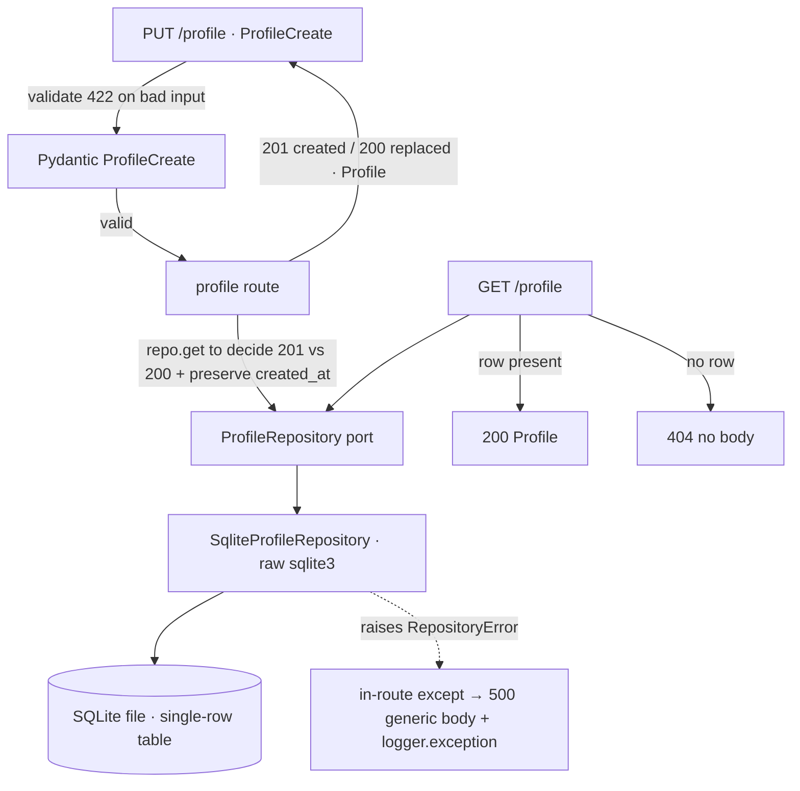

# Base CV / Structured Profile (M2) Design

**Spec**: `.specs/features/base-cv-profile/spec.md`
**Status**: Draft

---

## Architecture Overview

M2 reuses the M1 slice shape wholesale: an HTTP layer validates input, a domain
model is the canonical contract, a `ProfileRepository` **port** hides storage, and
a raw-`sqlite3` adapter implements it. The route resolves the port through
`app.state.profile_repo`, which is also the seam tests use to inject a failing or
in-memory repository. The `BodySizeLimitMiddleware`, `RepositoryError`, and the
`create_app` factory are all reused unchanged.

Three things are genuinely new versus M1, and they are where the design attention
goes:

1. **Single-row upsert semantics** — there is one canonical profile, not a
   collection. `PUT` is create-or-replace; the status code (`201` vs `200`) and
   the preservation of `created_at` across a replace both depend on whether a row
   already exists.
2. **Nested, cross-field-validated value objects** — `salary_expectation` is a
   list of ranges with `floor ≤ target ≤ ceiling` and no duplicate
   `(currency, contract)` key. This needs `model_validator`s, not just field
   validators.
3. **Fail-closed empty state** — `GET /profile` returns `404` when no row exists,
   never a hollow `200`.



Request flow for `PUT /profile`: middleware caps body at 50 KB → FastAPI parses
JSON → `ProfileCreate` runs validators (skill normalization + ≥1 skill, seniority
enum, salary ranges, per-field caps, `years_experience` range) → route calls
`repo.get()` to learn if a profile exists → builds a `Profile` (server sets
`created_at` — preserved from the existing row on replace — and a fresh
`updated_at`) → `repo.upsert(profile)` → `201` if it was a create, `200` if a
replace. Any repository exception is caught in-route and returned as `500` with a
generic constant body while the real cause is logged with `logger.exception`.

---

## Code Reuse Analysis

### Existing Components to Leverage

| Component | Location | How to Use |
| --------- | -------- | ---------- |
| `create_app()` factory | `src/jobpilot/app.py:85` | Extend: build a `SqliteProfileRepository` on the **same** connection and expose it on `app.state.profile_repo`; include the profile router. |
| `BodySizeLimitMiddleware` | `src/jobpilot/app.py:24` | Reuse unchanged — already caps every request at 50 KB with the 422 list envelope (BCP-13). |
| `RepositoryError` | `src/jobpilot/repository.py:34` | Reuse the **same** exception type for the profile adapter; the 500 mapping stays identical to M1. |
| 500 handling pattern | `src/jobpilot/routes/jobs.py:31-40` | Mirror: in-route `try/except RepositoryError` → `logger.exception(...)` + `JSONResponse(500, INTERNAL_ERROR_BODY)` (BCP-17, BCP-22). |
| `app.state` + `Depends` injection seam | `src/jobpilot/routes/jobs.py:24` | Same pattern: `get_profile_repository(request)` returns `request.app.state.profile_repo`; tests override it or pass a `:memory:` app. |
| Input/stored model split (`JobCreate`/`Job` + `new_from`) | `src/jobpilot/models.py` | Apply the same shape to `ProfileCreate`/`Profile`; server owns timestamps. |
| Parametrized adapter **contract test** | M1 test suite (per AD / design) | Extend the contract-test idea: one parametrized test runs `SqliteProfileRepository` and `FakeProfileRepository` through identical assertions so the Fake used in route tests cannot silently diverge (Fase 2 §8.3). |
| `pytest` + `TestClient` + coverage gate | `tests/`, `pyproject.toml` | Existing harness; new tests slot in. `caplog` drives the BCP-22 log assertion. |

### Integration Points

| System | Integration Method |
| ------ | ------------------ |
| FastAPI app | New `APIRouter` (`routes/profile.py`) included by `create_app()`. |
| SQLite | New `profile` table on the **same** connection/file as `jobs`; schema created idempotently on adapter init (`CREATE TABLE IF NOT EXISTS`). Single-row by construction (fixed primary key). |

---

## Components

### `Profile` + `ProfileCreate` + value objects (domain + input models)

- **Purpose**: The canonical `Profile` contract, the validated authoring input, and the nested value objects.
- **Location**: `src/jobpilot/models.py` (append; keep `Job`/`JobCreate` as-is)
- **Interfaces**:
  - `Seniority = Literal["junior", "pleno", "pleno-senior", "senior"]` — closed enum (AD-013); a bad value yields Pydantic's `enum`/`literal_error` → 422 naming `seniority` (BCP-10).
  - `Contract = Literal["CLT", "PJ", "other"]` — contract type for a salary range.
  - `class SalaryRange(BaseModel)`: `currency: str` (validated `^[A-Z]{3}$`, e.g. `BRL`/`USD`), `contract: Contract`, `floor: int`, `target: int`, `ceiling: int`. `model_validator(mode="after")` enforces `0 < floor ≤ target ≤ ceiling` (BCP-11).
  - `class Location(BaseModel)`: `remote_preference: Literal["remote", "hybrid", "onsite"]`, `open_to_international: bool = False`, `base_location: str | None = None` (≤512, trimmed), `timezone: str | None = None` (≤512, trimmed).
  - `class ProfileCreate(BaseModel)` — request body: `skills: list[str]`, `seniority: Seniority`, `years_experience: int | None = Field(default=None, ge=0, le=60)` (BCP-15), `salary_expectation: list[SalaryRange] = []`, `location: Location | None = None`, `raw_cv: str | None = None` (trimmed, ≤50 KB — BCP-14/-05). Validators: `skills` field validator trims, drops blanks, de-duplicates case-insensitively preserving first-seen order, enforces each ≤128 chars, and requires ≥1 remaining (else `value_error` naming `skills` — BCP-03/-09/-14). `model_validator` on `salary_expectation` rejects duplicate `(currency, contract)` pairs (BCP-12). Does **not** declare `created_at`/`updated_at`, so caller-supplied values are ignored (BCP-06).
  - `class Profile(BaseModel)` — response/stored model: all `ProfileCreate` fields (normalized) **plus** `created_at: datetime`, `updated_at: datetime` (server-owned).
  - `Profile.new_from(data: ProfileCreate, *, created_at: datetime | None = None) -> Profile` — builds a `Profile`; `created_at` is the passed existing value on a replace, or `datetime.now(UTC)` on first create; `updated_at` is always `datetime.now(UTC)`.
- **Dependencies**: `pydantic`, stdlib `datetime`, `re`.
- **Reuses**: Pydantic (transitive via FastAPI) — no new dependency.

### `ProfileRepository` port + `SqliteProfileRepository` adapter

- **Purpose**: Hide single-row profile persistence behind a swappable port; implement over raw `sqlite3`.
- **Location**: `src/jobpilot/repository.py` (append)
- **Interfaces**:
  - `class ProfileRepository(Protocol)`: `get() -> Profile | None`, `upsert(profile: Profile) -> Profile`.
  - `class SqliteProfileRepository`: `__init__(conn)` ensures schema. `get()` selects the single row (or `None`). `upsert(profile)` writes the one row with `INSERT ... ON CONFLICT(id) DO UPDATE` on the fixed key, inside one transaction; on `sqlite3.Error` it rolls back and raises the shared `RepositoryError` (atomic — a failed write leaves the prior row intact → BCP-16/-17). `salary_expectation`, `skills`, and `location` are stored as `json.dumps(...)` in `TEXT` columns and parsed back on read (same technique as `Job.requirements`).
  - Reuses the existing `RepositoryError`.
- **Dependencies**: stdlib `sqlite3`, `json`.
- **Reuses**: `RepositoryError` and the `Job` adapter's JSON-in-TEXT approach — zero new dependency (AD-008).

### profile router + app wiring

- **Purpose**: Expose the two endpoints and map storage failure to a leak-free 500.
- **Location**: `src/jobpilot/routes/profile.py`; wiring in `src/jobpilot/app.py`
- **Interfaces**:
  - `PUT /profile` → `200` (replaced) or `201` (created), body `Profile`. The route declares a default `200` and sets `response.status_code = 201` when `repo.get()` returned `None` (create). On a replace, `created_at` is carried over from the existing row (BCP-01/-02).
  - `GET /profile` → `200` `Profile` if a row exists; `404` with no body otherwise (route raises `HTTPException(404)`) (BCP-07/-08).
  - `get_profile_repository(request) -> ProfileRepository` — dependency provider; the override seam for tests.
  - `INTERNAL_ERROR_BODY = {"detail": "internal error"}` and in-route `try/except RepositoryError` → `logger.exception("failed to persist profile")` + `JSONResponse(500, INTERNAL_ERROR_BODY)` (BCP-17/-22). Mirrors `routes/jobs.py`; constant duplicated for now (a future refactor can lift it to a shared module).
- **Dependencies**: `fastapi`, the models and repository modules.
- **Reuses**: `create_app()` factory, `BodySizeLimitMiddleware`, `RepositoryError`.

---

## Data Models

```python
Seniority = Literal["junior", "pleno", "pleno-senior", "senior"]
Contract  = Literal["CLT", "PJ", "other"]

class SalaryRange(BaseModel):
    currency: str          # ^[A-Z]{3}$  e.g. "BRL", "USD"
    contract: Contract
    floor: int             # 0 < floor <= target <= ceiling
    target: int
    ceiling: int

class Location(BaseModel):
    remote_preference: Literal["remote", "hybrid", "onsite"]
    open_to_international: bool = False
    base_location: str | None = None    # <=512, trimmed
    timezone: str | None = None         # <=512, trimmed

class ProfileCreate(BaseModel):
    skills: list[str]                          # trimmed, blanks dropped, deduped (ci), >=1, each <=128
    seniority: Seniority
    years_experience: int | None = None        # ge=0, le=60
    salary_expectation: list[SalaryRange] = []  # no duplicate (currency, contract)
    location: Location | None = None
    raw_cv: str | None = None                   # verbatim after trim, <=50 KB, never parsed

class Profile(ProfileCreate):                  # or explicit copy of fields
    created_at: datetime                        # UTC, server-set, preserved across replace
    updated_at: datetime                        # UTC, server-set, changes every replace
```

SQLite table (single row, fixed key):

```sql
CREATE TABLE IF NOT EXISTS profile (
    id                 INTEGER PRIMARY KEY CHECK (id = 1),  -- enforces one row
    skills             TEXT NOT NULL DEFAULT '[]',          -- json.dumps(list[str])
    seniority          TEXT NOT NULL,
    years_experience   INTEGER,
    salary_expectation TEXT NOT NULL DEFAULT '[]',          -- json.dumps(list[SalaryRange])
    location           TEXT,                                -- json.dumps(Location) | NULL
    raw_cv             TEXT,
    created_at         TEXT NOT NULL,                       -- ISO-8601 UTC
    updated_at         TEXT NOT NULL                        -- ISO-8601 UTC
);
```

Upsert is `INSERT INTO profile (id, ...) VALUES (1, ...) ON CONFLICT(id) DO UPDATE SET ...`.
The `CHECK (id = 1)` constraint makes "single canonical profile" a storage
invariant, not just an application convention.

**Relationships**: none stored in M2. The Matcher (M3) will read `Profile` and a
`Job` and produce a `MatchResult`; the `404` empty state is the signal that no
match can be attempted yet.

---

## Error Handling Strategy

| Error Scenario | Handling | User Impact | Req |
| -------------- | -------- | ----------- | --- |
| Empty / all-blank `skills` | `skills` field validator raises `value_error` | `422`, `loc` names `skills` | BCP-09 |
| Missing / invalid `seniority` | Pydantic enum/`missing` | `422`, `loc` names `seniority` | BCP-10 |
| `salary` range not `0<floor≤target≤ceiling` | `SalaryRange` `model_validator` | `422`, `loc` names the entry | BCP-11 |
| Duplicate `(currency, contract)` | `ProfileCreate` `model_validator` on the list | `422` | BCP-12 |
| Empty / non-JSON / >50 KB body | JSON parse + `BodySizeLimitMiddleware` | `422` | BCP-13 |
| Skill >128 / free-text >512 / `raw_cv` >50 KB | field validators | `422`, `loc` names field | BCP-14 |
| `years_experience` out of `0..60` | `Field(ge=0, le=60)` | `422`, `loc` names field | BCP-15 |
| Caller sends `created_at`/`updated_at` | Not in `ProfileCreate` → dropped | ignored; server values used | BCP-06 |
| Optional field absent | Not fabricated; stored `NULL`/`[]` | field simply absent | BCP-04, BCP-20 |
| `raw_cv` present | Stored verbatim (after trim), never parsed | round-trips unchanged | BCP-05, BCP-18 |
| Skills differing by case/space | Normalized to one entry | deterministic storage | BCP-03, BCP-19 |
| `GET /profile`, no row | Route raises `HTTPException(404)` | `404`, no body | BCP-08 |
| Invalid replace after a valid create | Validation fails before `upsert`; prior row untouched | `422`, profile unchanged | BCP-16 |
| Repository/storage failure | In-route `except RepositoryError` → `500` **generic constant body**, never `str(exc)`; `logger.exception` records cause + traceback server-side | `500`, prior state intact (atomic), no SQL/stacktrace leaked | BCP-17, BCP-22 |

---

## Risks & Concerns

| Concern | Location | Impact | Mitigation |
| ------- | -------- | ------ | ---------- |
| `get()`-then-`upsert()` is a read-modify-write race under concurrency | `routes/profile.py` | Two simultaneous `PUT`s could interleave `created_at` | Single-user local tool (AD-010, briefing §6); document the no-concurrency assumption exactly as M1 did for `check_same_thread`. Not in scope to lock. |
| `INSERT OR REPLACE` would reset `created_at` | `SqliteProfileRepository.upsert` | Lose original creation time on replace | Use `ON CONFLICT(id) DO UPDATE` and only set `created_at` on insert; on replace the route passes the existing `created_at` into `Profile.new_from`. Test: create, capture `created_at`, replace, assert `created_at` unchanged and `updated_at` advanced. |
| Pydantic v2 skips validators on defaulted fields (Lesson L-001 from M1) | `models.py` optional fields | An optional-field branch (e.g. empty `salary_expectation`) may go untested if the field is omitted rather than passed | Test optional fields by passing them explicitly (`salary_expectation=[]`, `raw_cv=None`), not by omission — same lesson that caught the M1 null-link mutant. |
| `updated_at == created_at` on first create makes BCP-02's "changed `updated_at`" hard to assert if replace is instant | tests | Flaky/near-equal timestamps | Assert `updated_at >= created_at` and that a replace's `updated_at > ` the create's `updated_at`; if resolution is a risk, the replace test can assert monotonic non-decrease plus `created_at` equality (the load-bearing invariant). |
| Fake adapter diverging from the real one would validate a fiction | route tests | Green route tests over a wrong contract | Parametrized contract test runs both `SqliteProfileRepository` and `FakeProfileRepository` through identical assertions (reuse M1's pattern). |

---

## Tech Decisions (only non-obvious ones)

| Decision | Choice | Rationale |
| -------- | ------ | --------- |
| Single-row enforcement | `id INTEGER PRIMARY KEY CHECK (id = 1)` + `ON CONFLICT DO UPDATE` | Makes "one canonical profile" (AD-010) a storage invariant; upsert is atomic and full-replace. |
| `201` vs `200` on `PUT` | Route `get()`s first; sets `response.status_code = 201` only when no row existed | Honest create/replace signaling (BCP-01/-02) without a separate `POST`. |
| `created_at` on replace | Preserved from the existing row; only `updated_at` advances | Creation time is provenance; a replace is an edit, not a new object. |
| Salary as a list of `(currency, contract)` ranges | Nested `SalaryRange` + `model_validator` | Encodes AD-014: absent combo = indeterminate, never "any"; cross-field rule is testable and a clean mutation target. |
| Nested JSON in `TEXT` columns | `json.dumps`/`loads` for `skills`, `salary_expectation`, `location` | SQLite has no list/object type; same technique as `Job.requirements`; explicit (de)serialization is the mutation-test surface. |
| Reuse `RepositoryError` (not a new type) | Shared exception across both adapters | One 500-mapping story; the port contract stays uniform. |
| Contract test over both adapters | Parametrized `ProfileRepository` contract test | The Fake used in route injection tests cannot silently diverge from the real adapter; seeds Fase 2 §8.3. |
| `raw_cv` stored, never parsed | Plain `TEXT`, trimmed, capped | Matches `Job.description`; feeds M4 Generator without pretending to extract (AD-009). |

> **Project-level note:** No new `AD-NNN` is required — the design realizes AD-009..AD-014 already logged in `.specs/STATE.md`. Storage-invariant and status-code choices above are design-level and recorded here.

---

## Requirement Coverage Check

All 22 requirement IDs map to a component + error-handling row above:
BCP-01/-02 → route upsert + status; BCP-03/-19 → skills validator; BCP-04/-20 → optional-field handling; BCP-05/-18 → `raw_cv` verbatim + Unicode; BCP-06 → `ProfileCreate` shape; BCP-07/-08 → `GET /profile`; BCP-09 → skills ≥1; BCP-10 → seniority enum; BCP-11 → `SalaryRange` validator; BCP-12 → salary-list validator; BCP-13 → body/middleware; BCP-14 → per-field caps; BCP-15 → `years_experience` bound; BCP-16 → validation-before-upsert; BCP-17/-22 → repository atomicity + in-route 500 + `logger.exception`; BCP-21 → non-JSON → 422.
</content>
