# Generator (M4) Design

**Spec**: `.specs/features/generator/spec.md`
**Status**: Draft

---

## Architecture Overview

M4 reuses the M1/M2/M3 slice shape a third time — HTTP route → domain models →
a **port** hiding an external dependency → app-wired adapter resolved through
`app.state` and overridable via `Depends`. The new twist over M3: the endpoint
chains **two** LLM ports. `POST /jobs/{job_id}/generate` reads the Job + the
singleton Profile, runs the **M3 Matcher** internally for a *server-authoritative*
`MatchResult` (LLM call #1, AD-026), and only then calls the new **Generator**
port to draft a cover letter grounded in the Profile + Job + that result's gaps
(LLM call #2). Nothing is stored (AD-027); the draft is returned in the body.

Four things carry the design weight, and they map 1:1 to the spec's guardrails:

1. **Two fail-closed surfaces, one funnel.** Either LLM call can fail. The
   internal match funnels every match-side failure to `cannot_assess` (M3's
   existing `interpret`/`match_job`); the Generator adapter funnels every
   generation-side failure — API error, timeout, refusal, `max_tokens`
   truncation, empty/whitespace output — to `GeneratorError`. The orchestrator
   `generate_letter()` maps **both** a `cannot_assess` match and a
   `GeneratorError` to the single fail-closed constructor
   `GenerateResult.cannot_generate(reason)`. There is exactly one way to produce
   a `generated` result and several that all converge on `cannot_generate`
   (GEN-10..15, GEN-20, GEN-27).
2. **A self-validating `GenerateResult`.** A Pydantic `model_validator` makes the
   contract structural: `draft is None` **iff** `status == "cannot_generate"`
   (and, on success, `draft` is non-empty and ≤ `DRAFT_MAX`). A careless later
   edit that lets a `generated` status through with a null draft — or emits a
   non-null draft on a failure — fails construction. This is the structural
   anti-fail-open guard and a prime mutation target (reviewer note a).
3. **A grounded, machinery-hiding prompt.** The `SYSTEM_PROMPT` + `render()` are
   a first-class reviewable artifact (like M3's T3). The prompt instructs
   grounding-only-in-Profile+Job, honest gap framing, and — critically — that the
   gap list is *internal guidance the letter must never mention* (no "per the
   analysis, I have gaps in X"), so the output reads as a natural cover letter
   (reviewer note b). Language matches the Job posting, chosen by the model, no
   detection code (AD-030). Grounding carries no runtime authority — it is
   prompt-intended + **eval-measured**, never a runtime guarantee (AD-028).
4. **A key-free, single-attempt, side-effect-free call path.** The Generator
   adapter builds its Anthropic client lazily (no API key to import/start/test),
   calls it **once** with `max_retries=0` + a bounded `timeout` (mirroring
   AD-021/AD-022), and the route/service touch **no** repository writes (AD-027),
   proven by a spy-repository test.

```mermaid
graph TD
    C[POST /jobs/&#123;job_id&#125;/generate · no body] --> R[generator route]
    R -->|job_repo.get&#40;job_id&#41;| JR[JobRepository port]
    JR -->|None| NF[404 no body]
    JR -->|RepositoryError| E500[500 generic body + log]
    JR -->|Job| SVC[generate_letter service]
    R -->|profile_repo.get&#40;&#41;| PR[ProfileRepository port]
    PR -->|None → absent profile| CG1[cannot_generate · draft null · profile absent]
    PR -->|Profile| MJ[match_job · M3 Matcher port · LLM #1]
    MJ -->|cannot_assess| CG2[cannot_generate · draft null · match failed]
    MJ -->|strong/possible/weak + gaps| G[Generator port · LLM #2]
    G --> A[AnthropicGenerator · messages.create]
    A -->|GeneratorError: API error / timeout / refusal / max_tokens / empty| CG3[log + cannot_generate · generation failed]
    A -->|draft text| BR[build_result&#40;&#41; · trim + ≤ DRAFT_MAX]
    BR --> OK[GenerateResult · status generated · draft]
    OK --> RESP[200 GenerateResult]
    CG1 --> RESP
    CG2 --> RESP
    CG3 --> RESP
```



Request flow (no request body — GEN-06): the route reads the Job by id (`404` if
absent — GEN-14) and the singleton Profile; a `RepositoryError` on either read is
a generic `500` + server-side log (GEN-21), never a `cannot_generate`. It then
calls `generate_letter`. If the Profile is absent the service short-circuits to
`cannot_generate("profile absent")` **without any LLM call** (GEN-10). Otherwise
it runs `match_job` (LLM #1). A `cannot_assess` match short-circuits to
`cannot_generate("match failed")` **without the generation call** (GEN-11) — no
letter without a trustworthy gap analysis. Otherwise it calls the `Generator`
port once. Any `GeneratorError` (API error, timeout, refusal, `max_tokens`
truncation, unparseable/empty output) is caught, logged server-side with its
traceback, and mapped to `cannot_generate("generation failed")` (GEN-12/13/27).
A good draft becomes `GenerateResult(status="generated", …)` via `build_result`
(GEN-01). Nothing is written anywhere (GEN-16/17).

---

## Provider / Model Decision (via `claude-api` skill)

Deferred from Specify (AD-030); decided here, reusing the M3 `AnthropicMatcher`
adapter pattern wholesale. Consulted the `claude-api` skill for every SDK binding
below — none are guessed.

| Decision | Choice | Rationale |
| -------- | ------ | --------- |
| SDK | Official **`anthropic`** Python SDK | Same first-party SDK M3 already depends on; no new runtime dependency (M3 pinned `anthropic>=1.2`). |
| Model | **`claude-opus-4-8`** | The skill's non-negotiable default ("ALWAYS use `claude-opus-4-8` unless the user names another"); matches AD-022 and the briefing's "default latest Claude". Cover-letter generation is cheap at single-user volume. |
| Call surface | **`client.messages.create(...)`** → read the `text` content block | **Divergence from M3 (deliberate).** M3 used `messages.parse(output_format=…)` because it returned three *structured* fields (score/rationale/gaps). M4's output is a single **prose** cover letter; forcing multi-paragraph prose through a JSON-schema `str` field JSON-escapes the whole letter for zero safety gain (structured outputs strip nothing useful from a lone string), and the `claude-api` "Which Surface" table puts content generation on a plain one-request `messages.create`. The `stop_reason` / `max_retries` / `timeout` discipline is identical either way (AD-032). |
| Thinking / effort | `thinking={"type":"adaptive"}`, `output_config={"effort":"medium"}` | Same as M3. Writing a grounded letter benefits from adaptive thinking; `medium` balances quality vs. latency for a short artifact. Tunable. No `temperature`/`top_p` (removed on 4.8). |
| Single attempt | **`max_retries=0`** on the client | Disables the SDK's auto-retry so "single attempt, no retry" is real (AD-021). A transient blip → `cannot_generate`, not a hidden retry that masks a flaky provider. |
| Timeout | bounded `timeout=60.0` s (client-level) | On timeout the SDK raises `anthropic.APITimeoutError` → wrapped as `GeneratorError` → `cannot_generate`. 60 s gives adaptive thinking room; same value as M3. Tunable. |
| `max_tokens` | **`2048`** | A cover letter is short (~300–500 words ≈ ~700 tokens); 2048 gives ~3× headroom so a normal letter finishes with `stop_reason == "end_turn"`. If the model runs away and hits the cap, `stop_reason == "max_tokens"` → `GeneratorError` → `cannot_generate` (GEN-27) — a truncated letter is never returned. Well under the ~16 K non-streaming timeout guard, so **no streaming needed**. Tunable. |
| Refusal / truncation | `stop_reason in {"refusal", "max_tokens"}` → `GeneratorError` | Non-empty-but-untrustworthy text (a polite decline, or a letter cut off mid-sentence) fails closed, exactly as M3's adapter treats these (GEN-27). Opus 4.8 needs no Fable-5 server-side fallbacks. |

---

## Code Reuse Analysis

### Existing Components to Leverage

| Component | Location | How to Use |
| --------- | -------- | ---------- |
| `create_app()` factory | `src/jobpilot/app.py:88` | Extend: construct an `AnthropicGenerator` on `app.state.generator`; include the generator router. Client is lazy, so still no API key needed to create the app. |
| `app.state.matcher` (the M3 Matcher) | `src/jobpilot/app.py:103` | **Reused directly** — `generate_letter` recomputes the match through the same injected `Matcher` port. Tests inject a `FakeMatcher` for it (AD-026). |
| `match_job` + `interpret` (M3 service) | `src/jobpilot/matching.py:230` | **Reused verbatim** as LLM call #1. Its `cannot_assess` output is the fail-closed trigger (GEN-11); the returned `MatchResult.gaps` are the server-authoritative gaps the prompt grounds on. |
| `MatchResult` / `render(job, profile)` field helpers | `src/jobpilot/matching.py:103`, `models.py` | The generator's `render()` reuses the M3 field-rendering approach (verbatim `raw_cv`, `(not stated)` for absent optionals) so the letter is grounded on the same source of truth. |
| `app.state` + `Depends` injection seam | `routes/jobs.py:24`, `routes/matcher.py:30` | Same pattern: `get_generator(request)` returns `request.app.state.generator`; `get_matcher` is reused for the internal match. Tests override both with fakes. |
| `get_repository` / `get_profile_repository` | `routes/jobs.py:24`, `routes/profile.py:29` | Reuse to resolve the Job (`404`, GEN-14) and the singleton Profile. |
| `RepositoryError` → generic `500` + `logger.exception` | `routes/matcher.py:44-51` | Mirror exactly for the read path (GEN-21) — a storage fault is a `500`, never a `cannot_generate`. |
| `AnthropicMatcher` adapter shape | `src/jobpilot/matching.py:170` | `AnthropicGenerator` copies its lazy-client / `max_retries=0` / `timeout` / stop-reason / broad-except structure. |
| `INTERNAL_ERROR_BODY` | `routes/matcher.py:27` | Reuse the same generic 500 body constant (or a local copy) — no leak. |
| Fake test doubles | `tests/fakes.py` | Add `FakeGenerator` beside `FakeMatcher`; reuse the existing spy-repository pattern for the zero-writes test (GEN-16). |
| `pytest` + `TestClient` + coverage gate + `caplog` | `tests/`, `pyproject.toml` | Existing harness; `caplog` drives the GEN-12 log assertion. |
| Eval harness shape | `evals/matcher/` | `evals/generator/` mirrors it: human-labeled `corpus.json`, pure `metrics.py` (unit-tested under `tests/`), offline non-gating `run_eval.py`. |

### Integration Points

| System | Integration Method |
| ------ | ------------------ |
| FastAPI app | New `APIRouter` (`routes/generator.py`) included by `create_app()`. |
| Anthropic API | New `AnthropicGenerator` adapter (`anthropic` SDK, already a dependency); client lazy; injected client in unit tests (no network). |
| M3 Matcher | **In-process reuse** of the `Matcher` port + `match_job` service — no HTTP self-call; the generator calls the service function directly with the injected matcher. |
| SQLite | **None new.** M4 reads existing `jobs`/`profile` rows through the M1/M2 ports and writes nothing (ephemeral, AD-027). |

---

## Components

### `GenerateResult` + `GenStatus` + `DRAFT_MAX` (domain models)

- **Purpose**: The canonical, self-validating advisory result and its bounds.
- **Location**: `src/jobpilot/models.py` (append; leave `Job`/`Profile`/`MatchResult` as-is)
- **Interfaces**:
  - `GenStatus = Literal["generated", "cannot_generate"]` — the closed status enum (GEN-03).
  - `DRAFT_MAX = 6000` — per-draft character cap (a cover letter is a few paragraphs; 6000 chars ≈ ~1000 words is generous headroom, so truncation is a safety net, not the expected path). Tunable.
  - `GENERATED_REASON = "ok"` — the pinned success `reason` (reviewer note c): on success `reason` is a fixed constant, not model-derived and not free prose, so there is nothing to length-bound. Failure reasons are a closed internal set (`"profile absent"` | `"match failed"` | `"generation failed"`), also our own constants — never model output, so no cap needed.
  - `class GenerateResult(BaseModel)`: `status: GenStatus`, `draft: str | None`, `reason: str`. A `model_validator(mode="after")` enforces the contract: on `cannot_generate`, `draft is None`; on `generated`, `draft` is present, non-empty after strip, and `len(draft) <= DRAFT_MAX`. This is the structural anti-fail-open guard and a prime mutation target (GEN-03/15).
  - `GenerateResult.cannot_generate(reason: str) -> GenerateResult` — the single fail-closed constructor: `status="cannot_generate"`, `draft=None`, `reason=reason`.
- **Dependencies**: `pydantic`.
- **Reuses**: mirrors `MatchResult` + `MatchResult.cannot_assess` (the `null-iff` discipline).

### `Generator` port + `AnthropicGenerator` adapter + `FakeGenerator`

- **Purpose**: Hide the generation LLM behind a swappable port so the whole fail-closed path is unit-testable offline (GEN-18/19).
- **Location**: `src/jobpilot/generation.py` (new module); `FakeGenerator` in `tests/fakes.py`
- **Interfaces**:
  - `class GeneratorError(Exception)` — raised by an adapter when it cannot produce a trustworthy draft (API error, timeout, refusal, `max_tokens` truncation, empty/whitespace output). The single exception type the service catches.
  - `class Generator(Protocol)`: `generate(job: Job, profile: Profile, match: MatchResult) -> str` — returns the raw draft text or raises `GeneratorError`. Never returns a `GenerateResult` (mapping is the service's job). Takes the `MatchResult` so the prompt can ground on the server-authoritative gaps.
  - `class AnthropicGenerator`: `__init__(*, model="claude-opus-4-8", timeout=60.0, effort="medium", max_tokens=2048, client=None)`. `generate()` lazily builds `anthropic.Anthropic(max_retries=0, timeout=…)` (or uses the injected `client`), calls `client.messages.create(model=…, max_tokens=…, system=SYSTEM_PROMPT, messages=[{"role":"user","content": render(job, profile, match)}], thinking={"type":"adaptive"}, output_config={"effort": effort})`, checks `stop_reason`, extracts the `text` block, and returns it. Any `anthropic.AnthropicError`, a `refusal`/`max_tokens` stop reason, a missing/empty text block, or any other adapter-boundary fault is wrapped and re-raised as `GeneratorError`.
  - `class FakeGenerator` (tests): constructed with either a canned draft string **or** an exception to raise; records that `generate` was called. Drives the happy path, empty/whitespace draft, raised error, and simulated timeout deterministically with no network.
- **Dependencies**: `anthropic` SDK (already a runtime dep), `Job`/`Profile`/`MatchResult`.
- **Reuses**: the adapter+port+fake pattern from `AnthropicMatcher`.
- **Prompt is a first-class, reviewable artifact.** `SYSTEM_PROMPT` and `render(job, profile, match)` get their own authored+reviewed task in Tasks; the prompt text is surfaced for review (see § Reviewable Prompt below). It carries no runtime authority — grounding is prompt-intended + eval-measured (AD-028).

### `build_result()` + `generate_letter()` (the fail-closed mapper and orchestration)

- **Purpose**: Turn a raw draft (or any failure) into a validated `GenerateResult`; orchestrate profile-absent / match-failed / generation-error handling without side effects.
- **Location**: `src/jobpilot/generation.py`
- **Interfaces**:
  - `build_result(raw_draft: str) -> GenerateResult` — the success-side mapper. If `not raw_draft.strip()` → `GenerateResult.cannot_generate("generation failed")` (a hollow draft is a failure, GEN-13). Otherwise `GenerateResult(status="generated", draft=raw_draft.strip()[:DRAFT_MAX], reason=GENERATED_REASON)` — truncate over-length prose, don't fail (GEN-05). (Belt-and-suspenders with the adapter's empty-output guard; keeping the check here too means the fake can drive it without simulating the SDK.)
  - `generate_letter(job: Job, profile: Profile | None, matcher: Matcher, generator: Generator) -> GenerateResult` — the orchestrator:
    1. `if profile is None:` → `cannot_generate("profile absent")` — **no LLM call** (GEN-10).
    2. `match = match_job(job, profile, matcher)` — LLM #1 (reuses M3).
    3. `if match.verdict == "cannot_assess":` → `cannot_generate("match failed")` — **no generation call** (GEN-11). Generate on `strong`/`possible`/`weak` (GEN-04).
    4. `try: raw = generator.generate(job, profile, match)` → on `GeneratorError`, `logger.exception("generation failed")` + `cannot_generate("generation failed")` (GEN-12/27); on success `return build_result(raw)`.
    Pure w.r.t. storage — calls no writes (GEN-16/17).
- **Dependencies**: `logging`, the models, both ports, `match_job`.

### generator router + app wiring

- **Purpose**: Expose the endpoint; wire the adapter.
- **Location**: `src/jobpilot/routes/generator.py`; wiring in `src/jobpilot/app.py`
- **Interfaces**:
  - `POST /jobs/{job_id}/generate` → `200` with `GenerateResult` (`response_model=GenerateResult`). Takes **no request body** (job in path, profile is the singleton) — nothing for a caller to inject (GEN-06). Reads the job (`404` if missing, GEN-14) and profile behind a `try/except RepositoryError` → generic `500` + log (GEN-21), then returns `generate_letter(job, profile, matcher, generator)`.
  - `get_generator(request) -> Generator` — dependency provider resolving `request.app.state.generator`; the test override seam. `get_matcher` is imported from `routes/matcher.py` and reused for the internal match.
  - Wiring: `app.state.generator = AnthropicGenerator()`; `app.include_router(generator_router)`.
- **Dependencies**: `fastapi`, the generation module, the matcher provider, the two repository providers.
- **Reuses**: `create_app`, the `app.state`+`Depends` seam, `routes/matcher.py`'s 500-handling shape.

### Eval harness (Layer 2 — offline, non-gating)

- **Purpose**: Measure the *real* model's honesty against a human-labeled corpus (GEN-22..26). Not shipped in the package, not collected by pytest, not in the coverage gate — a flaky/real-LLM gate is a fail-open gate (AD-019/AD-028).
- **Location**: `evals/generator/` (outside `src/`, outside `tests/`)
  - `evals/generator/corpus.json` — human-labeled cases: each a `{job, profile, forbidden_facts: [str], gap_label?: str, expected_language: str, is_thin_job_probe: bool}`. Labels authored by the user, never AI-generated.
  - `evals/generator/metrics.py` — **pure** functions unit-tested under `tests/` (deterministic, no network): `fabrication_rate(letter, forbidden_facts)` (does the letter assert a forbidden fact?), `gap_claimed(letter, gap_label)` (is a gap phrased as possessed?), `language_matches(letter, expected_language)`, and thin-job padding detection. The string/heuristic matching lives here and is honestly caveated as approximate.
  - `evals/generator/run_eval.py` — runner: loads the corpus, runs the real `match_job` + `AnthropicGenerator` per case, computes metrics, prints a report that **states the small-corpus / directional caveat**. Requires `ANTHROPIC_API_KEY`; documented as offline and non-gating.
- **Dependencies**: `AnthropicGenerator`, `AnthropicMatcher`, `metrics.py`, the corpus.

---

## Data Models

```python
GenStatus = Literal["generated", "cannot_generate"]

DRAFT_MAX = 6000          # per-draft character cap; truncate, don't fail (GEN-05)
GENERATED_REASON = "ok"   # pinned success reason (not model-derived)

class GenerateResult(BaseModel):              # canonical, self-validating
    status: GenStatus
    draft: str | None                          # non-empty & <= DRAFT_MAX, or None iff cannot_generate
    reason: str

    @classmethod
    def cannot_generate(cls, reason: str) -> "GenerateResult":
        return cls(status="cannot_generate", draft=None, reason=reason)

    @model_validator(mode="after")
    def _consistent(self) -> "GenerateResult":
        if self.status == "cannot_generate":
            if self.draft is not None:
                raise ValueError("cannot_generate must have draft = None")
        else:  # generated
            if self.draft is None:
                raise ValueError("a generated result requires a draft")
            if not self.draft.strip():
                raise ValueError("a generated draft must be non-empty")
            if len(self.draft) > DRAFT_MAX:
                raise ValueError(f"draft must be at most {DRAFT_MAX} characters")
        return self
```

**File placement**: `GenStatus`, `DRAFT_MAX`, `GENERATED_REASON`, and
`GenerateResult` live in `src/jobpilot/models.py` (canonical shapes, mirroring
`MatchResult`). The `Generator` port, `AnthropicGenerator`, `GeneratorError`,
`SYSTEM_PROMPT`, `render`, `build_result`, and `generate_letter` live in
`src/jobpilot/generation.py`.

**Relationships**: `GenerateResult` is produced from a `Job` (M1) + `Profile`
(M2) + an internally-computed `MatchResult` (M3); **nothing is persisted**
(AD-027). No new SQLite table.

> **Note on L-001 (Pydantic v2 skips validators on defaults):** test the
> `draft`/`status` `null-iff` branches with **explicit** values — build a
> `generated` result with a real draft, a `cannot_generate` via the constructor,
> and drive the "generated but draft=None" / "cannot_generate but draft set"
> rejection paths by constructing them explicitly — not by omitting a field.

---

## Reviewable Prompt (first-class artifact — surfaced for review now)

The generation `SYSTEM_PROMPT` is the honesty-load-bearing artifact. Draft below,
surfaced per the Design-r1 requirement; Tasks gives it its own authored+reviewed
task and the final text is re-surfaced during Execute.

```text
You write a tailored cover letter for a candidate applying to a specific job. You
are advisory only: your draft helps a human who reviews and edits it before
anything is ever sent. You produce a DRAFT, never a final or submitted document.

Grounding rule (strict — this is the whole point):
- Use ONLY the facts in the Candidate Profile and the Job below. The Profile is
  BOTH the structured fields AND the candidate's raw CV text; a skill or
  experience stated only in the CV prose still counts.
- NEVER invent skills, employers, job titles, dates, degrees, certifications,
  achievements, or qualifications the Profile does not state. Do not upgrade or
  embellish a stated fact — "familiar with X" must not become "expert in X".
- If the Job asks for something the Profile does not evidence, do NOT claim it.
  You may honestly express motivation to grow into it, or connect a genuinely
  related strength the Profile does state — but never assert the candidate
  already has it.

Handling gaps honestly:
- You are given a list of gaps: the Job's requirements the Profile shows no
  evidence for. Address them honestly — as areas the candidate is motivated to
  develop, or by leaning on adjacent stated strengths. NEVER present a gap as an
  already-possessed skill.
- This gap list is internal guidance for you alone. NEVER mention it, quote it,
  or reference any analysis, score, match, evaluation, or "gaps" in the letter.
  Do not write things like "per the analysis" or "despite some gaps". The letter
  must read as a natural, self-contained cover letter.

Language:
- Write the letter in the language of the Job posting. If the posting's language
  is unclear, use the language of the candidate's CV.

Style and output:
- A concise, professional cover letter: a short opening, one or two body
  paragraphs connecting the candidate's real experience to the role, and a brief
  close. Where the Profile genuinely lacks a detail (e.g. the hiring manager's
  name), write naturally around it rather than inventing it.
- Do not mention salary, compensation, or pay expectations — those are handled
  elsewhere in the application.
- Output ONLY the letter text — no preamble, no explanation, no markdown headers,
  no notes to the reader.
```

`render(job, profile, match)` reuses M3's field-rendering approach (verbatim
`raw_cv`, `(not stated)` for absent optionals) — with **one deliberate
divergence: it OMITS `salary_expectation` entirely** (AD-032 refinement). A cover
letter must never cite salary/compensation; *not feeding* the figure to the model
is a stronger guarantee than instructing against it — the model cannot leak what
it never saw. (The M3 Matcher's `render` is unchanged; salary is legitimate
scoring signal there. This is the generator's own `render` only.) `base_location`
stays in the render as **neutral context only** — no instruction to feature or
downplay remote/location preference. Gaps are appended under an explicit
**internal-guidance** header, e.g.:

```text
=== JOB ===            (title / company / description / requirements)
=== CANDIDATE PROFILE === (skills / seniority / years / location / CV verbatim — NO salary)
=== GAPS (internal guidance — do NOT mention in the letter) ===
- <gap 1>
- <gap 2>
(or "(none)" when the match found no gaps)
```

The header text itself instructs non-disclosure, backing the system-prompt rule
that the letter must never expose the match/gap machinery (reviewer note b). The
eval harness measures whether the model actually complies (GEN-22/23).

---

## Error Handling Strategy

| Scenario | Handling | Client sees | Req |
| -------- | -------- | ----------- | --- |
| Unknown `job_id` | Route `HTTPException(404)` | `404`, no body | GEN-14 |
| Job/Profile read raises | `try/except RepositoryError` → generic `500` + `logger.exception` | `500` generic body | GEN-21 |
| No profile authored (M2 empty state) | `generate_letter` short-circuits before any LLM call | `200` `cannot_generate`, `draft=null`, `reason="profile absent"` | GEN-10 |
| Internal match `cannot_assess` (its LLM error/timeout/malformed, or absent-profile already handled) | `generate_letter` short-circuits before the generation call | `200` `cannot_generate`, `reason="match failed"` | GEN-11 |
| Generation API error / timeout | `AnthropicGenerator` raises `GeneratorError`; service `logger.exception` + `cannot_generate`; **no retry** (`max_retries=0`) | `200` `cannot_generate`, `reason="generation failed"` | GEN-12 |
| Generation refusal / `max_tokens` truncation | Adapter treats stop reason as failure → `GeneratorError` → `cannot_generate` (+ log) | `200` `cannot_generate` | GEN-27 |
| Empty / whitespace-only draft | Adapter (and `build_result` belt-and-suspenders) → `GeneratorError`/`cannot_generate` — never a hollow letter | `200` `cannot_generate` | GEN-13 |
| Weak match verdict | Still generates (weak is a valid basis with real gaps) | `200` `generated` | GEN-04 |
| Over-length draft (> `DRAFT_MAX`) on a normal completion | `build_result` truncates (advisory prose), not fail | `200` `generated`, `draft ≤ DRAFT_MAX` | GEN-05 |
| Caller sends a request body | Ignored — no body param declared; all fields server/pipeline-owned | `200` normal result | GEN-06 |
| Any uncertainty condition | `GenerateResult` `model_validator` + single `cannot_generate` constructor | never a non-null draft on failure; `draft` null **iff** `cannot_generate` | GEN-15/20 |
| Generate requested | Route + service perform only `.get()` reads; no writes/outbound actions | advisory only | GEN-16/17 |

---

## Risks & Concerns

| Concern | Location | Impact | Mitigation |
| ------- | -------- | ------ | ---------- |
| Two LLM calls per request | `generate_letter` | Higher latency + a second fail surface | Accepted (AD-026): the second fail surface is the point — both funnel to `cannot_generate`. Latency is fine for a single-user, human-in-the-loop draft. |
| Real LLM call can't be covered by the offline unit gate | `AnthropicGenerator.generate` | Coverage gate drops on the network line | Inject a **fake `anthropic` client** in unit tests to cover the create-success, `AnthropicError`→`GeneratorError`, timeout→`GeneratorError`, refusal→`GeneratorError`, `max_tokens`→`GeneratorError`, and empty-text→`GeneratorError` branches without network. Only the lazy `anthropic.Anthropic(...)` construction line carries `# pragma: no cover`. |
| Constructing the client at import/startup needs an API key | `create_app` / adapter `__init__` | App won't start / tests can't import without a key | Build the client **lazily on first `generate()`**; `__init__` stores config only. A missing key surfaces as `GeneratorError` → `cannot_generate`, not a startup crash. |
| The prompt could still fabricate / leak the gap machinery | `SYSTEM_PROMPT` | An LLM can't be runtime-forced to obey | By design: grounding + gap-honesty + non-disclosure are prompt-intended and **eval-measured** (AD-028), not runtime-checked. The harness's fabrication-rate / gap-honesty / language metrics are the QE substitute. |
| Pydantic v2 skips validators on defaulted fields (L-001) | `models.py` | The `draft`/`status` branches may go untested if omitted rather than passed | Test optional/branch fields **explicitly** — construct each `GenerateResult` shape directly (see the L-001 note above). |
| Sensor restore rewriting LF→CRLF on Windows (L-002) | Verify phase | Throwaway sensor could drift line endings | Write the sensor's restore in binary / `newline=""`, or run it on a scratch branch; run sensors only against a **committed** tree (M3 process note). |
| `messages.create` returns thinking + text blocks | `AnthropicGenerator.generate` | Reading `content[0]` blindly could grab a thinking block | Extract with `next((b.text for b in resp.content if b.type == "text"), None)`; `None`/empty → `GeneratorError` (never a hollow draft). |

---

## Tech Decisions (only non-obvious ones)

| Decision | Choice | Rationale |
| -------- | ------ | --------- |
| Recompute the match internally | `generate_letter` calls `match_job` (LLM #1) before generating | Gaps are server-authoritative; caller can't forge them (AD-026). |
| Plain `messages.create`, not `messages.parse` | read the `text` block for prose | A cover letter is a single prose field; a JSON-schema `str` wrapper only JSON-escapes the letter for no safety gain (AD-032). Same stop-reason/timeout discipline. |
| `GenerateResult` self-validates | `model_validator` enforces `draft null iff cannot_generate` (+ non-empty, ≤ DRAFT_MAX on success) | Makes the anti-fail-open contract structural, not conventional; a bad edit fails construction (GEN-15, reviewer note a). |
| One fail-closed constructor + one success mapper | `GenerateResult.cannot_generate` (all failures) + `build_result` (success/empty) | Every fail-open path converges on `cannot_generate` (GEN-20); mirrors M3's `cannot_assess` + `interpret`. |
| Generate on weak, refuse only without a basis | verdict `weak` still generates; only `cannot_assess`/generation-failure refuse | A weak fit has real gaps to frame honestly; refusing there over-blocks and overrides the human (AD-029). |
| Pinned success `reason`, closed failure-reason set | `GENERATED_REASON="ok"`; failures ∈ fixed strings | `reason` is never model-derived, so no length bound is needed (reviewer note c). |
| `max_retries=0` + bounded `timeout` | on the Anthropic client | Single-attempt, fail-closed; no hidden retry masking a flaky provider (AD-021). |
| Lazy client construction | build `anthropic.Anthropic(...)` on first call | Key-free import/startup/tests; missing key → `cannot_generate`, not a crash. |
| Ephemeral, no new table | route/service only `.get()` | Persistence deferred to M5; enforces side-effect-free advisory (AD-027). |
| Prompt hides the gap machinery | system prompt + render's "internal guidance — do NOT mention" header | The letter must read naturally; measured by the harness (reviewer note b, AD-028). |
| Generator `render` omits `salary_expectation` | drop salary from the generator's `render` (M3's is unchanged) + one prompt line | Structural non-leak: the letter must never cite pay, and the model cannot leak a figure it never saw — stronger than instructing against it. `base_location` stays as neutral context, with no feature/downplay instruction (AD-032 refinement). |
| Eval harness outside `src/` and `tests/` | `evals/generator/`, non-gating | Real-LLM calls kept out of the commit gate (AD-019); metric math is pure and unit-tested under `tests/`. |

> **Project-level note:** two new decisions to log in `.specs/STATE.md`:
> **AD-031** (provider/model + SDK reuse + single-attempt/timeout/max_tokens
> config for the Generator) and **AD-032** (plain `messages.create` over
> `messages.parse` for prose; self-validating `GenerateResult`; pinned success
> `reason`; `DRAFT_MAX`). Everything else realizes AD-025..030.

---

## Requirement Coverage Check

All 27 requirement IDs map to a component + error-handling row above:

- **GEN-01** → generator route + `generate_letter` + `build_result` (200 with `GenerateResult`).
- **GEN-02** → `generate_letter` recomputes the match via `match_job` before generating.
- **GEN-03** → `GenerateResult` + `GenStatus` + `model_validator` (draft non-null iff generated).
- **GEN-04** → `generate_letter` generates on `strong`/`possible`/`weak` (only `cannot_assess` short-circuits).
- **GEN-05** → `build_result` truncates to `DRAFT_MAX`, does not fail.
- **GEN-06** → route declares no body param; all fields server-owned.
- **GEN-07/08/09** → `SYSTEM_PROMPT` + `render` (grounding, gap-honesty, job-language) — prompt-intended, harness-measured. Generator `render` **omits `salary_expectation`** (structural non-leak) + a prompt line forbids citing pay (AD-032 refinement).
- **GEN-10** → `generate_letter` profile-absent short-circuit → `cannot_generate`, no LLM call.
- **GEN-11** → `generate_letter` match-`cannot_assess` short-circuit → `cannot_generate`, no generation call.
- **GEN-12** → `AnthropicGenerator` → `GeneratorError`; `generate_letter` `logger.exception` + `cannot_generate`; `max_retries=0`.
- **GEN-13** → adapter + `build_result` empty/whitespace → `cannot_generate`, never a hollow letter.
- **GEN-14** → route `job_repo.get` → `404`.
- **GEN-15** → `GenerateResult` `model_validator` (no non-null draft under failure; null iff cannot_generate).
- **GEN-16/17** → route/service `.get()`-only; spy-repo zero-writes test; no auto-send.
- **GEN-18/19** → `Generator` Protocol + `FakeGenerator` (+ injected `FakeMatcher`); offline unit suite.
- **GEN-20** → single `GenerateResult.cannot_generate` funnel + `build_result`.
- **GEN-21** → route `RepositoryError` → generic `500` + log.
- **GEN-22/23/24/25/26** → `evals/generator/` corpus + pure `metrics.py` (fabrication rate, gap-honesty, language, thin-job padding, small-corpus caveat), offline/non-gating.
- **GEN-27** → `AnthropicGenerator` stop-reason check (`refusal`/`max_tokens`) → `GeneratorError` → `cannot_generate`.
