# Matcher (M3) Design

**Spec**: `.specs/features/matcher/spec.md`
**Status**: Draft

---

## Architecture Overview

M3 reuses the M1/M2 slice shape one more time — HTTP route → domain models →
a **port** hiding an external dependency → app-wired adapter resolved through
`app.state` and overridable via `Depends`. The new twist is that the port hides
an **LLM** instead of a database, and the external call is *non-deterministic*,
so the design puts a hard, deterministic seam between "get the model's raw
judgment" and "decide what the `MatchResult` is".

Three things carry all the design weight, and they map 1:1 to the spec's
guardrails:

1. **A single fail-closed mapper.** The LLM adapter returns a *loose, untrusted*
   raw judgment (or raises); one pure function `interpret()` turns that raw
   judgment — or any failure — into a validated `MatchResult`. Every fail-open
   path (out-of-range score, empty rationale, LLM error/timeout, absent profile)
   funnels through this one function, so "uncertainty → `cannot_assess` + null"
   is enforced in exactly one place and mutation-tested there.
2. **A self-validating `MatchResult`.** Pydantic `model_validator`s make the
   contract structural: `score is None` **iff** `verdict == cannot_assess`,
   `gaps == []` on `cannot_assess`, and (for decided verdicts) the verdict must
   equal the score's band. A careless later edit that lets a high score through
   with a broken verdict fails construction — a natural mutation target.
3. **A key-free, single-attempt, side-effect-free call path.** The adapter
   builds the Anthropic client lazily (no API key needed to import or start the
   app or run the unit suite), calls it **once** with `max_retries=0` + a bounded
   `timeout` (AD-021), and the route/service touch **no** repository writes
   (AD-020), proven by a spy-repository test.

```mermaid
graph TD
    C[POST /jobs/&#123;job_id&#125;/match · no body] --> R[matcher route]
    R -->|job_repo.get&#40;job_id&#41;| JR[JobRepository port]
    JR -->|None| NF[404 no body]
    JR -->|Job| SVC[match_job service]
    R -->|profile_repo.get&#40;&#41;| PR[ProfileRepository port]
    PR -->|None → absent profile| CA1[interpret → cannot_assess · score null]
    PR -->|Profile| M[Matcher port]
    M --> A[AnthropicMatcher · messages.parse]
    A -->|MatcherError: API error / timeout / refusal / unparseable| CA2[log + cannot_assess]
    A -->|MatcherLLMOutput raw score/rationale/gaps| INT[interpret&#40;&#41; · single fail-closed mapper]
    INT -->|score out of 0..100 / empty rationale| CA3[cannot_assess · never clamp]
    INT -->|valid| OK[MatchResult · verdict from bands · gaps · rationale ≤500]
    OK --> RESP[200 MatchResult]
    CA1 --> RESP
    CA2 --> RESP
    CA3 --> RESP
```



Request flow for `POST /jobs/{job_id}/match` (no request body): the route reads
the Job by id (`404` if absent — MATCH-09), reads the singleton Profile, then
calls the `match_job` service. If the Profile is absent the service short-circuits
to `cannot_assess` **without** calling the LLM (MATCH-06). Otherwise it calls the
`Matcher` port exactly once. Any `MatcherError` (API error, timeout, refusal,
unparseable output) is caught, logged server-side with its traceback, and mapped
to `cannot_assess` (MATCH-07). A parsed-but-bad judgment (score outside `0..100`,
empty rationale) is mapped to `cannot_assess` by `interpret()` — never clamped
(MATCH-08). A good judgment becomes a `MatchResult` whose verdict is derived from
the score bands (MATCH-01/02). Nothing is written anywhere (MATCH-11/12).

---

## Provider / Model Decision (via `claude-api` skill)

Deferred from Specify (AD-021); decided here.

| Decision | Choice | Rationale |
| -------- | ------ | --------- |
| SDK | Official **`anthropic`** Python SDK | The `claude-api` skill mandates the first-party SDK for a Python project; no raw HTTP, no OpenAI-compatible shim. First third-party runtime dependency in the project. |
| Model | **`claude-opus-4-8`** | The skill's non-negotiable default ("ALWAYS use `claude-opus-4-8` unless the user explicitly names another"). Latest Claude, matches the briefing's "default latest Claude". $5/$25 per MTok, 1M context — cost per match is negligible at single-user volume. |
| Structured output | **`client.messages.parse(output_format=MatcherLLMOutput)`** → `response.parsed_output` | The recommended structured-output path; returns a validated Pydantic instance so the adapter never hand-parses JSON. Note the API strips numeric `minimum`/`maximum` from the schema (unsupported), which is *why* score bounds live in our own mapper, not the schema (see AD-023). |
| Thinking / effort | `thinking={"type":"adaptive"}`, `output_config={"effort":"medium"}` | Fit-scoring is a judgment task, so adaptive thinking helps; `medium` effort balances quality vs. latency/cost for a scoped classification-style task. Tunable. No `temperature`/`top_p` (removed on 4.8) — determinism isn't available, which is exactly why Layer 2 (eval harness) exists. |
| Single attempt | **`max_retries=0`** on the client | The SDK auto-retries 408/429/5xx by default; `0` disables that, making "single attempt, no retry" (AD-021) real. A transient blip → `cannot_assess`, not a hidden retry. |
| Timeout | bounded `timeout=60.0` s (client-level) | On timeout the SDK raises `anthropic.APITimeoutError` → wrapped as `MatcherError` → `cannot_assess`. 60 s gives adaptive thinking room while staying well under any request-timeout guard. Tunable. |
| Refusal | `stop_reason == "refusal"` (or incomplete/`max_tokens`) → `MatcherError` | Opus 4.8 doesn't need Fable-5 server-side fallbacks; a refusal is just another "cannot evaluate" → `cannot_assess`. |

---

## Code Reuse Analysis

### Existing Components to Leverage

| Component | Location | How to Use |
| --------- | -------- | ---------- |
| `create_app()` factory | `src/jobpilot/app.py:86` | Extend: construct an `AnthropicMatcher` and expose it on `app.state.matcher`; include the matcher router. The matcher builds its client lazily, so no API key is needed to create the app. |
| `app.state` + `Depends` injection seam | `src/jobpilot/routes/jobs.py:24`, `routes/profile.py:29` | Same pattern: `get_matcher(request)` returns `request.app.state.matcher`; tests override it with a `FakeMatcher`. |
| `get_repository` (jobs) | `src/jobpilot/routes/jobs.py:24` | Import and reuse to resolve the `JobRepository` for the `job_id` lookup / `404` (MATCH-09). |
| `get_profile_repository` | `src/jobpilot/routes/profile.py:29` | Import and reuse to read the singleton Profile (the M2 `404` empty state becomes the `cannot_assess` signal). |
| 500 / logging discipline | `src/jobpilot/routes/profile.py:46-53` | Mirror the `logger.exception(...)` pattern for the LLM-failure path (MATCH-07) — real cause logged server-side, client sees only `cannot_assess`. |
| `Job`, `Profile` models | `src/jobpilot/models.py` | Read-only inputs to the matcher; rendered into the prompt. `MatchResult` is appended to the same module. |
| Fake test doubles | `tests/fakes.py` | Add `FakeMatcher` next to `FakeJobRepository`/`FakeProfileRepository`; add spy variants (or a call-recording flag) for the zero-writes test (MATCH-11). |
| `pytest` + `TestClient` + coverage gate | `tests/`, `pyproject.toml` | Existing harness; `caplog` drives the MATCH-07 log assertion. |

### Integration Points

| System | Integration Method |
| ------ | ------------------ |
| FastAPI app | New `APIRouter` (`routes/matcher.py`) included by `create_app()`. |
| Anthropic API | New `AnthropicMatcher` adapter using the `anthropic` SDK; client built lazily; injected client in unit tests (no network). |
| SQLite | **None new.** M3 reads existing `jobs`/`profile` rows through the M1/M2 ports and writes nothing (ephemeral, AD-017). |

---

## Components

### `MatchResult` + `Verdict` + band mapping (domain models)

- **Purpose**: The canonical, self-validating advisory result and the pure score→verdict band function.
- **Location**: `src/jobpilot/models.py` (append; leave `Job`/`Profile` as-is)
- **Interfaces**:
  - `Verdict = Literal["strong", "possible", "weak", "cannot_assess"]` — the closed enum (AD-015).
  - `verdict_for_score(score: int) -> Verdict` — pure band function: `0–39 → weak`, `40–74 → possible`, `75–100 → strong` (MATCH-02). No LLM, fully unit-testable; boundaries pinned by tests.
  - `class MatchResult(BaseModel)`: `score: int | None`, `verdict: Verdict`, `gaps: list[str] = []`, `rationale: str`. A `model_validator(mode="after")` enforces the contract: on `cannot_assess`, `score is None` **and** `gaps == []`; on a decided verdict, `score` is present, in `0..100`, and `verdict == verdict_for_score(score)`; `len(rationale) <= 500`, `len(gaps) <= MAX_GAPS` (20), and each gap `<= GAP_MAX` (128) always (MATCH-03/04/10/20). This is the structural anti-fail-open guard and a prime mutation target.
  - `MatchResult.cannot_assess(reason: str) -> MatchResult` — constructor for the fail-closed result: `score=None`, `verdict="cannot_assess"`, `gaps=[]`, `rationale=reason.strip()[:500]`.
- **Dependencies**: `pydantic`.
- **Reuses**: Pydantic (already transitive). No new dependency for the model itself.

### `MatcherLLMOutput` (the narrow LLM contract)

- **Purpose**: The *loose*, untrusted shape the LLM is asked to return — parsed but not range-validated, so all validation stays centralized in `interpret()`.
- **Location**: `src/jobpilot/matching.py` (**pinned**). It is a transient wire contract consumed only by `AnthropicMatcher` and `interpret()`, both in `matching.py`; keeping it there leaves `models.py` for the canonical stored/returned shapes (`Job`, `Profile`, `MatchResult`). `MatchResult` and `verdict_for_score` stay in `models.py`.
- **Interfaces**:
  - `class MatcherLLMOutput(BaseModel)`: `score: int`, `rationale: str`, `gaps: list[str] = []`. **No `ge`/`le` on score** — an out-of-range value must be *accepted here* and *rejected by `interpret()`* so the "never clamp, fail closed" path is deterministically testable via the fake (and because structured outputs strip numeric bounds from the schema anyway). Extra/unknown fields are ignored (Pydantic default).
- **Dependencies**: `pydantic`.

### `Matcher` port + `AnthropicMatcher` adapter + `FakeMatcher`

- **Purpose**: Hide the LLM behind a swappable port so the whole fail-closed path is unit-testable offline (MATCH-13/14).
- **Location**: `src/jobpilot/matching.py` (new module); `FakeMatcher` in `tests/fakes.py`
- **Interfaces**:
  - `class MatcherError(Exception)` — raised by an adapter when it cannot produce a judgment (API error, timeout, refusal, incomplete/unparseable output). The single exception type the service catches.
  - `class Matcher(Protocol)`: `evaluate(job: Job, profile: Profile) -> MatcherLLMOutput` — returns the raw judgment or raises `MatcherError`. Never returns a `MatchResult` (mapping is the service's job).
  - `class AnthropicMatcher`: `__init__(*, model="claude-opus-4-8", timeout=60.0, effort="medium", client=None)`. `evaluate()` lazily builds `anthropic.Anthropic(max_retries=0, timeout=...)` (or uses the injected `client`), calls `client.messages.parse(model=..., max_tokens=..., system=SYSTEM_PROMPT, messages=[{"role":"user","content": render(job, profile)}], output_format=MatcherLLMOutput, thinking={"type":"adaptive"}, output_config={"effort": effort})`, checks `stop_reason`, and returns `response.parsed_output`. Any `anthropic.APIError`/`APITimeoutError`, a `refusal`/incomplete stop reason, or a Pydantic validation error is wrapped and re-raised as `MatcherError`.
  - `class FakeMatcher` (tests): constructed with either a canned `MatcherLLMOutput` **or** an exception to raise; records that `evaluate` was called. Drives the happy path, out-of-range score, empty rationale, raised error, and simulated timeout deterministically with no network.
- **Dependencies**: `anthropic` SDK (new runtime dependency), `Job`/`Profile`/`MatcherLLMOutput`.
- **Reuses**: the port+adapter+fake pattern from M1/M2 repositories.
- **Prompt is a first-class, reviewable artifact.** `SYSTEM_PROMPT` and `render(job, profile)` are **not** an Execute-time detail — Tasks gives them their own authored+reviewed task, surfacing the prompt text for review. The prompt must cover: (a) **grounding** — "use only the Profile and Job; never invent skills or experience" (MATCH-03/AD-018); (b) the **output format** the `parse` contract expects (integer `score` 0–100, short `rationale`, `gaps` = job requirements with no Profile evidence); (c) **conservative scoring on sparse/thin jobs** — a title/company-only posting must not read as a strong fit (pairs with the MATCH-19 thin-job probe). It carries no runtime authority — grounding is prompt-intended + eval-measured, never a runtime guarantee (AD-018).

### `interpret()` + `match_job()` (the fail-closed mapper and orchestration)

- **Purpose**: Turn a raw judgment (or failure) into a validated `MatchResult`; orchestrate profile-absent / LLM-error handling without side effects.
- **Location**: `src/jobpilot/matching.py`
- **Interfaces**:
  - `interpret(raw: MatcherLLMOutput) -> MatchResult` — the single fail-closed mapper. If `not (0 <= raw.score <= 100)` → `MatchResult.cannot_assess("model returned an out-of-range score")` (never clamp, MATCH-08). If `raw.rationale.strip()` is empty → `cannot_assess("model returned an empty rationale")` (edge case). Otherwise build a decided `MatchResult`: `verdict_for_score(score)`, `gaps=[g.strip()[:GAP_MAX] for g in raw.gaps if g.strip()][:MAX_GAPS]` (each entry trimmed to ≤128 chars, at most 20 entries — dropped/truncated, **not** fail-closed, since gaps are advisory prose like the rationale), `rationale=raw.rationale.strip()[:500]` (truncate, not fail — approved `n` default).
  - `match_job(job: Job, profile: Profile | None, matcher: Matcher) -> MatchResult` — if `profile is None` → `cannot_assess("no profile has been authored")` (MATCH-06), **no LLM call**. Else `try: raw = matcher.evaluate(job, profile)` → on `MatcherError`, `logger.exception("matcher evaluation failed")` + `cannot_assess("the evaluation could not be completed")` (MATCH-07); on success `result = interpret(raw)`, and if `result.verdict == "cannot_assess"` also `logger.warning("unusable matcher output: %r", raw)` so bad content is diagnosable too. Pure w.r.t. storage — calls no writes (MATCH-11/12).
- **Dependencies**: `logging`, the models, the port.

### matcher router + app wiring

- **Purpose**: Expose the endpoint; wire the adapter.
- **Location**: `src/jobpilot/routes/matcher.py`; wiring in `src/jobpilot/app.py`
- **Interfaces**:
  - `POST /jobs/{job_id}/match` → `200` with `MatchResult` (`response_model=MatchResult`). Takes **no request body** (job in path, profile is the singleton) — nothing for a caller to inject (MATCH-05). Reads the job (`404` if missing, MATCH-09), reads the profile, returns `match_job(job, profile, matcher)`.
  - `get_matcher(request) -> Matcher` — dependency provider resolving `request.app.state.matcher`; the test override seam.
  - Wiring: `app.state.matcher = AnthropicMatcher()`; `app.include_router(matcher_router)`.
- **Dependencies**: `fastapi`, the matching module, the two repository providers.
- **Reuses**: `create_app`, the `app.state`+`Depends` seam.

### Eval harness (Layer 2 — offline, non-gating)

- **Purpose**: Measure the *real* model's quality against a human-labeled corpus (MATCH-15..19). Not shipped in the package, not collected by pytest, not in the coverage gate — a flaky/real-LLM gate is a fail-open gate (AD-019).
- **Location**: `evals/matcher/` (outside `src/`, outside `tests/`)
  - `evals/matcher/corpus.json` — ~8–12 **human-labeled** cases: each a `{job, profile, expected_band, is_fabrication_probe, is_thin_job_probe, expected_gap?}`. Labels authored by the user, never AI-generated.
  - `evals/matcher/metrics.py` — **pure** functions: precision/recall on strong-vs-not, fabrication rate, `cannot_assess` correctness. These are unit-tested under `tests/` (deterministic, no network) so the metric math is covered.
  - `evals/matcher/run_eval.py` — runner: loads the corpus, calls the real `AnthropicMatcher` per case, computes metrics via `metrics.py`, prints a report that **states the small-corpus / directional caveat** (MATCH-18). Requires `ANTHROPIC_API_KEY`; documented as offline and non-gating. The network call itself is not covered by the gate.
- **Dependencies**: `AnthropicMatcher`, `metrics.py`, the corpus. Fabrication probe (MATCH-17): a job requiring a skill the profile lacks → assert (across the corpus) the gap is named and the verdict isn't `strong`. Thin-job probe (MATCH-19): a title/company-only job → assert it doesn't score `strong`.

---

## Data Models

```python
Verdict = Literal["strong", "possible", "weak", "cannot_assess"]

WEAK_MAX = 39
POSSIBLE_MAX = 74
RATIONALE_MAX = 500
GAP_MAX = 128          # per-entry cap, mirrors M2's MAX_SKILL_LEN
MAX_GAPS = 20          # cap the number of gap entries

def verdict_for_score(score: int) -> Verdict:      # pure; boundaries pinned by tests
    if score <= WEAK_MAX:
        return "weak"
    if score <= POSSIBLE_MAX:
        return "possible"
    return "strong"

class MatcherLLMOutput(BaseModel):                 # loose LLM contract (no range bounds)
    score: int
    rationale: str
    gaps: list[str] = []

class MatchResult(BaseModel):                      # canonical, self-validating
    score: int | None                              # 0..100, or None iff cannot_assess
    verdict: Verdict
    gaps: list[str] = []                           # [] when cannot_assess
    rationale: str                                 # <= 500, always present

    @classmethod
    def cannot_assess(cls, reason: str) -> "MatchResult":
        return cls(score=None, verdict="cannot_assess", gaps=[],
                   rationale=reason.strip()[:RATIONALE_MAX])

    @model_validator(mode="after")
    def _consistent(self) -> "MatchResult":
        if len(self.rationale) > RATIONALE_MAX:
            raise ValueError("rationale must be at most 500 characters")
        if len(self.gaps) > MAX_GAPS:
            raise ValueError(f"at most {MAX_GAPS} gaps")
        if any(len(g) > GAP_MAX for g in self.gaps):
            raise ValueError(f"each gap must be at most {GAP_MAX} characters")
        if self.verdict == "cannot_assess":
            if self.score is not None:
                raise ValueError("cannot_assess must have score = None")
            if self.gaps:
                raise ValueError("cannot_assess must have empty gaps")
        else:
            if self.score is None:
                raise ValueError("a decided verdict requires a score")
            if not 0 <= self.score <= 100:
                raise ValueError("score must be in 0..100")
            if verdict_for_score(self.score) != self.verdict:
                raise ValueError("verdict must match the score band")
        return self
```

**File placement** (the block above is illustrative — grouped for readability):
`Verdict`, `verdict_for_score`, the `*_MAX` constants, and `MatchResult` live in
`src/jobpilot/models.py` (canonical shapes, mirroring `Job`/`Profile`);
`MatcherLLMOutput` lives in `src/jobpilot/matching.py` (transient wire contract),
which imports the constants from `models.py`.

**Relationships**: `MatchResult` is produced from a `Job` (M1) + `Profile` (M2)
via the matcher; **nothing is persisted** (AD-017). No new SQLite table.

---

## Error Handling Strategy

| Scenario | Handling | Client sees | Req |
| -------- | -------- | ----------- | --- |
| Unknown `job_id` | Route `HTTPException(404)` | `404`, no body | MATCH-09 |
| No profile authored (M2 empty state) | `match_job` short-circuits before any LLM call | `200` `cannot_assess`, `score=null`, `gaps=[]` | MATCH-06 |
| LLM API error / timeout | `AnthropicMatcher` raises `MatcherError`; service `logger.exception` + `cannot_assess`; **no retry** (`max_retries=0`) | `200` `cannot_assess` | MATCH-07 |
| LLM refusal / incomplete (`max_tokens`) output | Adapter treats as failure → `MatcherError` → `cannot_assess` (+ log) | `200` `cannot_assess` | MATCH-07 |
| Unparseable LLM JSON (parse raises) | Adapter wraps as `MatcherError` → `cannot_assess` (+ log) | `200` `cannot_assess` | MATCH-08 |
| Score outside `0..100` / wrong type / non-numeric string | `interpret()` → `cannot_assess`; **never clamp**; `logger.warning` for diagnosability | `200` `cannot_assess` | MATCH-08 |
| Empty/whitespace rationale on a scored result | `interpret()` → `cannot_assess` (+ warning) | `200` `cannot_assess` | edge case |
| Over-length model rationale | Truncated to 500 (prose, not safety-bearing — approved `n` default) | `200` decided verdict, `rationale ≤ 500` | MATCH-04 |
| Over-long gap entry / too many gaps | `interpret()` trims each gap to ≤128 chars and keeps at most 20 (advisory prose, not safety-bearing — same policy as rationale); validator enforces the caps | `200` decided verdict, bounded `gaps` | MATCH-03 |
| Thin job (empty description/requirements) | Still evaluated; a sparse job is a *low/uncertain score*, not `cannot_assess` | `200` decided verdict | edge case |
| Caller sends a request body | Ignored — no body param declared; all fields server/pipeline-owned | `200` normal result | MATCH-05 |
| Any uncertainty condition | Guaranteed by `MatchResult`'s `model_validator` + `interpret()` | never a high score / non-null on uncertainty | MATCH-10/20 |
| Match requested | Route + service perform only `.get()` reads; no writes/outbound actions | advisory only | MATCH-11/12 |

---

## Risks & Concerns

| Concern | Location | Impact | Mitigation |
| ------- | -------- | ------ | ---------- |
| Real LLM call can't be covered by the offline unit gate | `AnthropicMatcher.evaluate` | Coverage gate drops below 80% on the network line | Inject a **fake `anthropic` client** in unit tests to cover the parse-success, validation-error→`MatcherError`, `APIError`→`MatcherError`, `APITimeoutError`→`MatcherError`, and refusal→`MatcherError` branches without network. Only the lazy `anthropic.Anthropic(...)` construction line carries `# pragma: no cover`. |
| Constructing the client at import/startup would require an API key | `create_app` / adapter `__init__` | App won't start / tests can't import without a key | Build the client **lazily on first `evaluate()`**; `__init__` stores config only. A missing key surfaces as `MatcherError` → `cannot_assess`, not a startup crash. |
| Structured outputs strip numeric `min`/`max` from the schema | `AnthropicMatcher` parse model | An out-of-range score could slip past schema validation | Intentional: the LLM contract (`MatcherLLMOutput`) is deliberately loose; range enforcement lives in `interpret()` (AD-023), which is unit-tested with the fake. |
| Pydantic v2 skips validators on defaulted fields (Lesson L-001) | `models.py`, `matching.py` | The `gaps=[]` default branch / optional paths may go untested if omitted rather than passed | Test optional fields **explicitly** — pass `gaps=[]`, construct `MatcherLLMOutput` with and without `gaps`, and build `MatchResult.cannot_assess` and decided results directly. |
| Sensor restore rewriting LF→CRLF on Windows (Lesson L-002) | Verify phase | Throwaway sensor could drift line endings | Write the sensor's restore in binary / `newline=""`, or run it on a scratch branch. |
| New runtime dependency (`anthropic`) | `pyproject.toml` | First third-party runtime dep; supply-chain surface (Fase 2 `pip-audit`) | Add `anthropic` to `dependencies` with a floor version that supports `messages.parse` structured outputs; pin exactly at Execute. Note in CHANGELOG. |
| Non-determinism makes `assert ==` impossible | whole feature | Can't unit-test the *judgment* | By design: Layer 1 fakes the LLM for the plumbing; Layer 2 eval harness measures the real judgment offline (AD-019). |

---

## Tech Decisions (only non-obvious ones)

| Decision | Choice | Rationale |
| -------- | ------ | --------- |
| Loose LLM contract + one central mapper | `MatcherLLMOutput` (no bounds) → `interpret()` validates everything | Puts every fail-open path through one pure, mutation-tested function; lets the fake simulate out-of-range/empty deterministically (AD-023). |
| `MatchResult` self-validates | `model_validator` enforces score↔verdict↔gaps↔null | Makes the anti-fail-open contract structural, not conventional; a bad edit fails construction (MATCH-10/20). |
| Verdict derived, never model-supplied | pure `verdict_for_score` band function | Single source of truth = the score; verdict can't contradict it (AD-016). |
| LLM behind a `Matcher` Protocol port | adapter + fake, mirroring the repositories | The deterministic seam; whole suite runs offline (MATCH-13/14). |
| `max_retries=0` + bounded `timeout` | on the Anthropic client | Enforces single-attempt, fail-closed; no hidden retry masking a flaky provider (AD-021). |
| Lazy client construction | build `anthropic.Anthropic(...)` on first call | Key-free import/startup/tests; missing key → `cannot_assess`, not a crash. |
| Ephemeral, no new table | route/service only `.get()` | Persistence deferred to M5; enforces side-effect-free advisory (AD-017/020). |
| Eval harness outside `src/` and `tests/` | `evals/matcher/`, non-gating | Real-LLM calls kept out of the commit gate — a flaky gate is a fail-open gate (AD-019); metric math is pure and unit-tested under `tests/`. |
| Numeric-string coercion | rely on schema `integer` type + Pydantic lax coerce; non-int → fail closed | A value not representable as an integer in `0..100` becomes `cannot_assess` via `interpret()`/parse error; the fail-closed floor is fixed. |

> **Project-level note:** two new decisions are logged in `.specs/STATE.md`:
> **AD-022** (provider/model + SDK + single-attempt/timeout config) and **AD-023**
> (loose LLM contract + central `interpret()` + self-validating `MatchResult`).
> Everything else realizes AD-015..AD-021.

---

## Requirement Coverage Check

All 20 requirement IDs map to a component + error-handling row above:

- **MATCH-01** → matcher route + `match_job` + `AnthropicMatcher` (200 with `MatchResult`).
- **MATCH-02** → `verdict_for_score` band function (pure).
- **MATCH-03** → `interpret()` gaps normalization + eval harness measurement (MATCH-17).
- **MATCH-04** → `interpret()` rationale trim/truncate ≤500 + `MatchResult` validator.
- **MATCH-05** → route declares no body param; all fields server-owned.
- **MATCH-06** → `match_job` profile-absent short-circuit → `cannot_assess`.
- **MATCH-07** → `AnthropicMatcher` → `MatcherError`; `match_job` `logger.exception` + `cannot_assess`; `max_retries=0`.
- **MATCH-08** → `interpret()` out-of-range/type → `cannot_assess`, never clamp; adapter wraps parse errors.
- **MATCH-09** → route `job_repo.get` → `404`.
- **MATCH-10** → `MatchResult` `model_validator` (no high score/non-null under uncertainty).
- **MATCH-11/12** → route/service `.get()`-only; spy-repo zero-writes test.
- **MATCH-13/14** → `Matcher` Protocol + `FakeMatcher`; offline unit suite.
- **MATCH-15/16/18** → `evals/matcher/` runner + corpus + `metrics.py`, offline/non-gating, caveated report.
- **MATCH-17** → fabrication probe in the corpus + `metrics.py` fabrication rate.
- **MATCH-19** → thin-job probe in the corpus.
- **MATCH-20** → `MatchResult.cannot_assess` (`gaps=[]`) + validator.
