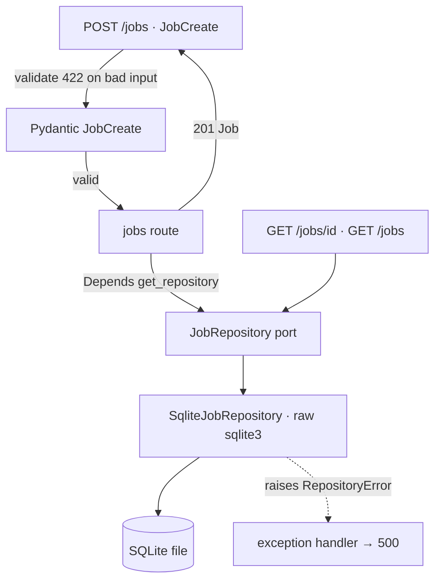

# PastedJobSource + canonical Job (M1) Design

**Spec**: `.specs/features/pasted-job-source/spec.md`
**Status**: Draft

---

## Architecture Overview

A thin, layered slice that honors the briefing's ports-and-adapters intent. The
HTTP layer validates input; a domain `Job` model is the canonical contract; a
`JobRepository` **port** hides storage; a raw-`sqlite3` adapter implements it.
The route depends on the port through FastAPI's `Depends`, which is also the
seam tests use to inject a failing or in-memory repository.



Request flow for `POST /jobs`: FastAPI parses JSON → `JobCreate` runs field
validators (trim, non-blank, ≤512, lenient link) → route builds a canonical
`Job` (server sets `id`/`source`/`created_at`) → `repo.add(job)` → `201`.
Any repository exception is caught centrally and returned as `500` with nothing
persisted.

---

## Code Reuse Analysis

### Existing Components to Leverage

| Component | Location | How to Use |
| --------- | -------- | ---------- |
| `create_app()` factory | `src/jobpilot/app.py:13` | Extend: register the jobs router, the `get_repository` dependency, and the exception handler inside the factory so each test gets a clean app. |
| `__version__` | `src/jobpilot/__init__.py` | Reference (already surfaced on `/health`; no change). |
| `pytest` + `TestClient` + coverage gate | `tests/`, `pyproject.toml` | Existing harness; new tests slot in. `app.dependency_overrides` drives the injection seam. |

### Integration Points

| System | Integration Method |
| ------ | ------------------ |
| FastAPI app | New `APIRouter` included by `create_app()`; no global state. |
| SQLite | New file DB; path from a setting (default `./jobpilot.db`, gitignored). Schema created on repository init (idempotent `CREATE TABLE IF NOT EXISTS`). |

---

## Components

### `Job` + `JobCreate` (domain + input models)

- **Purpose**: The canonical `Job` contract and the validated paste input.
- **Location**: `src/jobpilot/models.py`
- **Interfaces**:
  - `JobCreate` — request body: `title: str`, `company: str`, `description: str | None = None`, `requirements: list[str] = []`, `link: str | None = None`. Field validators: strip whitespace; reject blank `title`/`company` (`value_error`); reject `title`/`company` > 512 chars; **lenient** link — if present and not a well-formed `http(s)` URL, coerce to `None` and log a warning (never raise). Does **not** declare `id`/`source`/`created_at`, so caller-supplied values are ignored (Pydantic drops unknown fields by default) — satisfies PJS-18.
  - `Job` — response/stored model: `id: str`, `source: Literal["pasted"] = "pasted"`, `title: str`, `company: str`, `description: str = ""`, `requirements: list[str] = []`, `link: str | None = None`, `created_at: datetime`.
  - `Job.new_from(data: JobCreate) -> Job` — builds a `Job`, server-generating `id` (`uuid4().hex`), `created_at` (`datetime.now(UTC)`), `source="pasted"`, normalizing absent `description` to `""`.
- **Dependencies**: `pydantic` (already via FastAPI), stdlib `uuid`, `datetime`, `logging`.
- **Reuses**: Pydantic (transitive dep of FastAPI) — no new dependency.

### `JobRepository` port + `SqliteJobRepository` adapter

- **Purpose**: Hide persistence behind a swappable port; implement it over raw `sqlite3`.
- **Location**: `src/jobpilot/repository.py`
- **Interfaces**:
  - `class JobRepository(Protocol)`: `add(job: Job) -> Job`, `get(job_id: str) -> Job | None`, `list_all() -> list[Job]`.
  - `class RepositoryError(Exception)` — raised on any storage failure; mapped to `500` by the app.
  - `class SqliteJobRepository`: `__init__(conn: sqlite3.Connection)` ensures schema (`CREATE TABLE IF NOT EXISTS jobs(...)`). `add` does one `INSERT` then `commit`; on `sqlite3.Error` it rolls back and raises `RepositoryError` (atomic — a failed insert commits nothing → PJS-14). `list_all` returns newest-first (`ORDER BY created_at DESC, rowid DESC`). `requirements` is stored as `json.dumps(...)` in a `TEXT` column and parsed back on read.
- **Dependencies**: stdlib `sqlite3`, `json`.
- **Reuses**: nothing external — zero new dependency (per AD-008).

### jobs router + app wiring

- **Purpose**: Expose the three endpoints and centralize error mapping.
- **Location**: `src/jobpilot/routes/jobs.py`; wiring in `src/jobpilot/app.py`
- **Interfaces**:
  - `POST /jobs` → `201`, body `Job`. Depends on `get_repository`.
  - `GET /jobs/{job_id}` → `200` `Job`; `404` if unknown (route raises `HTTPException(404)`).
  - `GET /jobs` → `200` `list[Job]` (empty list when none).
  - `get_repository() -> JobRepository` — dependency provider; the **override seam** for tests (`app.dependency_overrides[get_repository] = ...`).
  - App-level: `@app.exception_handler(RepositoryError)` → `JSONResponse(status_code=500, ...)`; a **body-size guard** (middleware or dependency) rejects payloads > 50 KB with `422` before validation (PJS-10) — checks `Content-Length` and caps the read.
- **Dependencies**: `fastapi`, the models and repository modules.
- **Reuses**: `create_app()` factory.

---

## Data Models

```python
# Canonical Job (response + stored shape)
class Job(BaseModel):
    id: str                          # uuid4().hex, server-set
    source: Literal["pasted"] = "pasted"
    title: str
    company: str
    description: str = ""
    requirements: list[str] = []
    link: str | None = None
    created_at: datetime             # UTC, server-set

# Input (validated paste)
class JobCreate(BaseModel):
    title: str                       # trimmed, non-blank, <=512
    company: str                     # trimmed, non-blank, <=512
    description: str | None = None   # trimmed
    requirements: list[str] = []
    link: str | None = None          # lenient: malformed -> None + warning
```

SQLite table:

```sql
CREATE TABLE IF NOT EXISTS jobs (
    id           TEXT PRIMARY KEY,
    source       TEXT NOT NULL,
    title        TEXT NOT NULL,
    company      TEXT NOT NULL,
    description  TEXT NOT NULL DEFAULT '',
    requirements TEXT NOT NULL DEFAULT '[]',   -- json.dumps(list[str])
    link         TEXT,
    created_at   TEXT NOT NULL                 -- ISO-8601 UTC
);
```

**Relationships**: none in M1. `Job` is the root the Matcher (M3) and Queue (M5) will reference by `id`.

---

## Error Handling Strategy

| Error Scenario | Handling | User Impact | Req |
| -------------- | -------- | ----------- | --- |
| Missing/blank `title`/`company` | Pydantic validator raises → `RequestValidationError` | `422`, default envelope, `loc` names field | PJS-08 |
| Empty/whitespace-only body | JSON decode / required-field failure | `422` | PJS-09 |
| Payload > 50 KB | Body-size guard rejects before parsing | `422` | PJS-10 |
| `title`/`company` > 512 chars | Pydantic validator | `422`, `loc` names field | PJS-19 |
| Malformed `link` | **Lenient** — coerce to `None`, `logger.warning` | `201`, `link: null` | PJS-11 |
| Non-JSON content-type / bad JSON | FastAPI body parsing | `422` | PJS-17 |
| Unknown id on `GET /jobs/{id}` | Route raises `HTTPException(404)` | `404`, no body | PJS-06 |
| Repository/storage failure | `RepositoryError` caught in-route → `500` with a **generic constant body** (`{"detail": "internal error"}`), never `str(exc)` | `500`, nothing persisted (atomic), no stacktrace/SQL/exception text leaked | PJS-14 |
| Caller supplies `id`/`source`/`created_at` | Not in `JobCreate` → dropped | ignored; server values used | PJS-18 |

---

## Risks & Concerns

| Concern | Location (file:line) | Impact | Mitigation |
| ------- | -------------------- | ------ | ---------- |
| FastAPI does **not** cap request body size by default; a naive `Content-Length` check is spoofable and streaming bodies omit it | new `app.py` guard | Oversized paste (PJS-10) could slip the bound | Guard reads at most 50 KB + 1 and rejects on overflow (don't trust `Content-Length` alone); test with a >50 KB body and a lying header. |
| SQLite connection sharing across threads (`check_same_thread`) with FastAPI's threadpool | new `repository.py` | Runtime error under the default sync route threadpool | Open the connection with `check_same_thread=False` and one connection per app; document single-user assumption (AD-007). Concurrency beyond that is out of M1 scope. |
| `created_at` string ordering for newest-first | `SqliteJobRepository.list_all` | Wrong order if timestamps collide | Order by `created_at DESC, rowid DESC`; ISO-8601 UTC sorts lexically. |
| Lenient link could silently swallow a typo'd but intended URL | `models.py` link validator | User loses a link without noticing | Emit a `logger.warning` with the rejected value (per PJS-11); acceptable because link is unused in M1 and re-paste is cheap. |

---

## Tech Decisions (only non-obvious ones)

| Decision | Choice | Rationale |
| -------- | ------ | --------- |
| Persistence adapter | Raw `sqlite3` behind `JobRepository` Protocol | Zero new deps, domain `Job` decoupled from storage, trivial failing-path injection, clean mutation-test target (AD-008). |
| Input vs. stored model split | Separate `JobCreate` / `Job` | Server owns `id`/`source`/`created_at`; caller cannot set them (PJS-18) without a `forbid`-extra dance. |
| Link on failure | Coerce to `None` + warn, never raise | Link is optional and never fetched in M1; rejecting on an unused field is over-blocking (AD-003). |
| Test injection seam | `Depends(get_repository)` + `dependency_overrides` | Lets PJS-14 inject a repo whose `add` raises, and lets happy-path tests use an in-memory `sqlite3` DB. |
| `requirements` storage | `json.dumps` in a `TEXT` column | SQLite has no list type; explicit (de)serialization is the mutation-test surface. |
| Port fidelity | One parametrized **contract test** runs both `SqliteJobRepository` and `FakeJobRepository` through identical assertions | The Fake used in the route injection tests cannot silently diverge from the real adapter — otherwise T4 would validate a fiction. Seeds the Fase 2 §8.3 adapter contract-testing story. |
| 500 body | Generic constant, never `str(exc)` | A `500` that echoes the exception/SQL is an information leak; the failing-path test asserts the body is generic. |

> **Project-level decision:** AD-008 (raw `sqlite3` behind the port) is appended to `.specs/STATE.md`.

---

## Requirement Coverage Check

All 19 requirement IDs map to a component + error-handling row above:
PJS-01/02/03/05 → models + route (persist); PJS-04/11 → link validator; PJS-13 → models defaults;
PJS-06/07 → GET by id; PJS-12 → list; PJS-08/09/10/17/19 → validation + body guard;
PJS-14 → repository atomicity + handler; PJS-15 → models (no mutation of text); PJS-16 → uuid per paste; PJS-18 → JobCreate shape.
